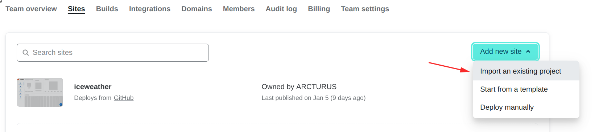
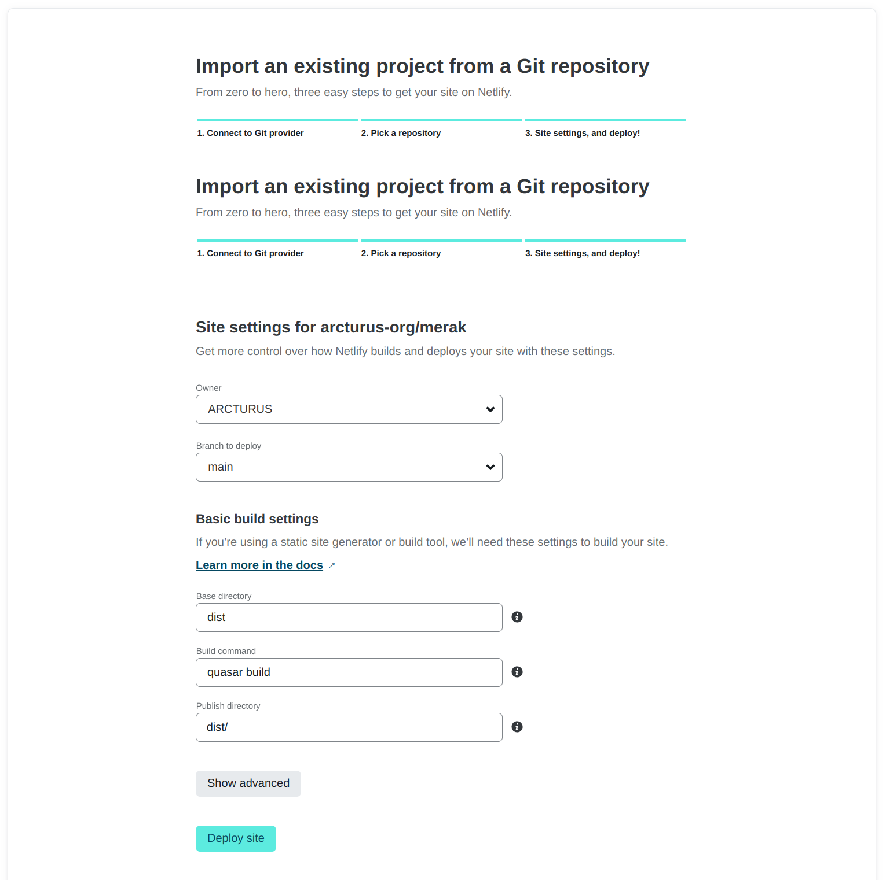
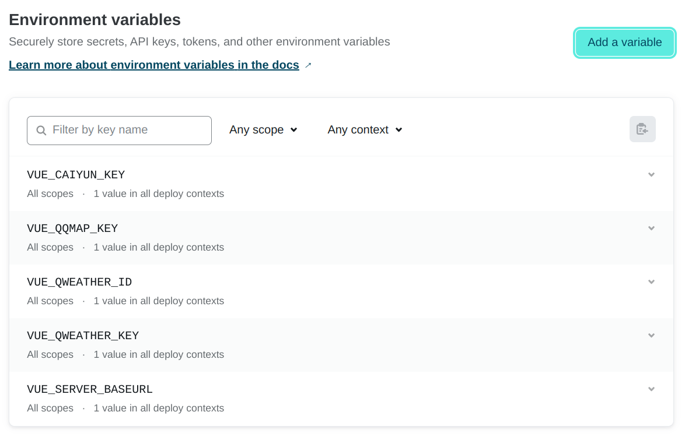

<div align="center">

<h1>小冰天气</h1>

[](https://github.com/ICE99125/iweather-vue/issues) [](https://github.com/ICE99125/iweather-vue/network) [](https://github.com/ICE99125/iweather-vue/stargazers) 

[demo](https://iceweather.netlify.app/) | [backend](https://github.com/arcturus-org/weather_serve)

</div>

## 本地开发

### 安装依赖

```bash
pnpm install
```

### 环境变量

根目录下新建 .env 文件

```
VUE_QWEATHER_KEY=xxx # 和风天气

VUE_QWEATHER_ID=xxx # 和风天气 publicID

VUE_CAIYUN_KEY=xxx # 彩云天气

VUE_QQMAP_KEY=xxx # 腾讯地图

VUE_SERVER_BASEURL=127.0.0.1:8090 # 小冰天气后端地址
```

### 运行

```bash
quasar dev
```

### 打包

```bash
quasar build
```

启用 sorcemap

```
quasar build --debug
```

## 部署

### Netlify







环境变量的填写需要在部署之前, 否则不生效

## Contributors

[](https://github.com/arcturus-org/merak/graphs/contributors)
